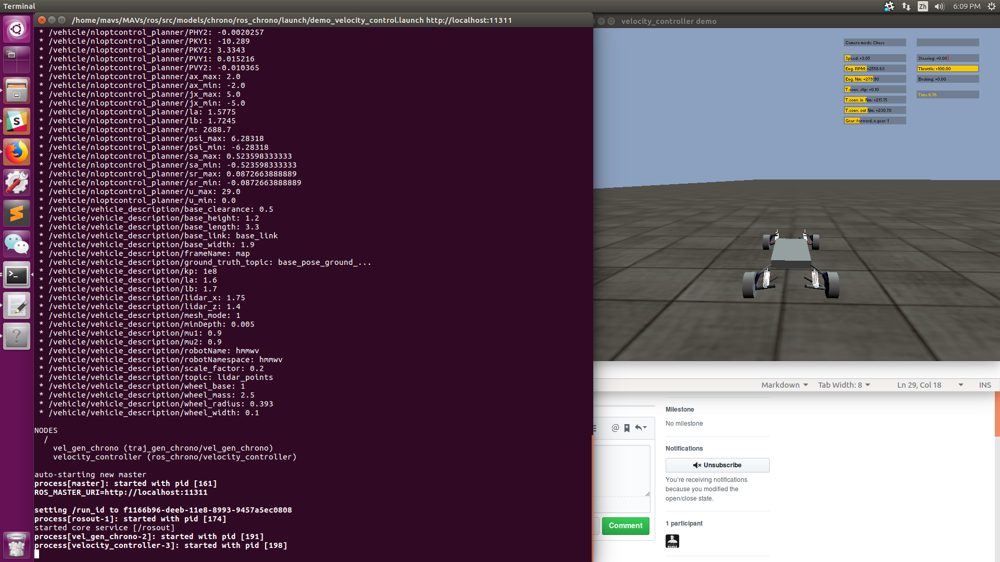

# ros_chrono

A vehicle model in `Chrono` that can be used through `ROS`.

## Status == working
The vehicle model currently runs with rigid tire models, a rear-wheel driveline, double wishbone suspension (reduced so that the control arm positions are distance constraints), and rack and pinion steering.

## To run

```
$ cd $HOME/MAVs/ros
$ roslaunch ros_chrono demo.launch
$ rosparam set system/default/flags/initialized true
```

## Expected Output


## To run velocity test
Velocity test shows the ability of chorono to exchange information with ros. 
```
$ roslaunch ros_chrono demo_velocity_control.launch
```
## Expected Output

=======
## To test (Currently not integrated with .travis)
Following code will run the test on ros node and library to check if everything is correct. For library gtest, it's always true since specific test on each library hasn't been finished. Then for the ros node test, it will test demoA.launch as example.
```
$ cd MAVs/ros
$ catkin_make run_tests
```


## To run steering tracking test
steering tracking test shows the ability of chorono to exchange information with ros. 
```
$ cd $HOME/MAVs/ros
$ roslaunch ros_chrono steering.launch
```
## Expected Output

Under a constant speed, the vehicle will be controlled by the steering angle command to follow the steering angle trajectory.

