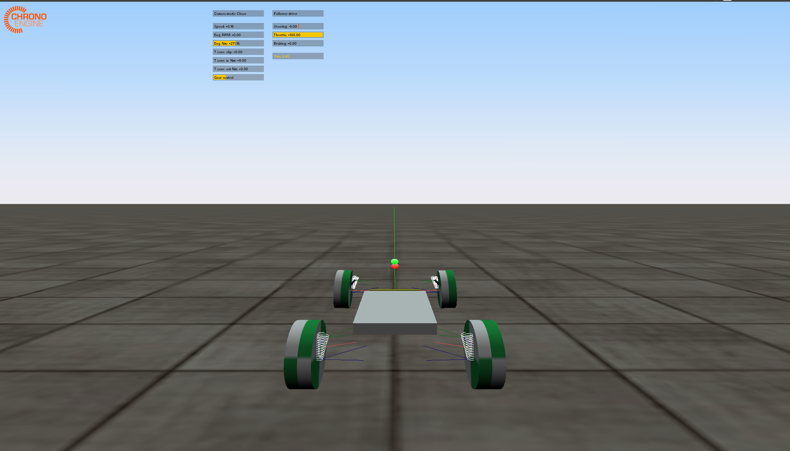
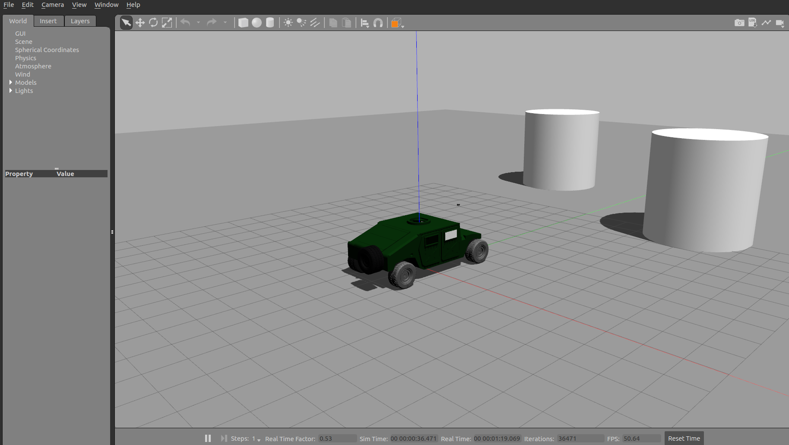
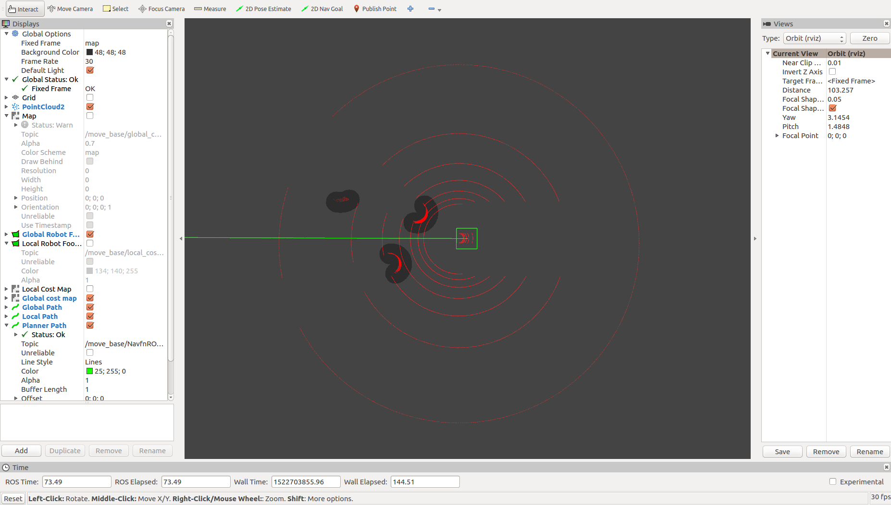

# demoD

## vehicle_description, ros_base_planner and chrono

A demo showing a completely integrated, end-to-end setup with a moving vehicle in Gazebo/Chrono that uses a trajectory planned by `ros_base_planner`.

### status = working

## To Run
```
roslaunch system demoD.launch
```

## Expected Output
Gazebo and Chrono would open with the vehicle and Rviz will pop up showing LIDAR scan data. Chrono simulation start takes a while.

Case | Description
--- | ---
system/ros_base_planner/flags/goal_known = `false` | User can click on publish goal button in Rviz and select a goal point within the gloabl cost map area. The planner would plan a path from start to goal and display it. The vehicle in chrono should start moving.
system/ros_base_planner/flags/goal_known = `true` | Planner would pick the goal coordinates from the case file. The trajectory would be shown on Rviz and the vehicle in Gazebo and Chrono should start moving.

Once, the trajectory is published on Rviz, ros parameter `/system/ros_base_planner/initialized` will be set to `true`

#### Output windows





### Note
- Unless there is a path displayed on Rviz, Chrono will not start. Chrono waits for planner to get initialized, that means, the planner has successfully published a global plan at least once.
- Presently, at startup, Chrono vehicles spawns at z > 0, first it lands on the ground and then starts moving. This process takes a while.
