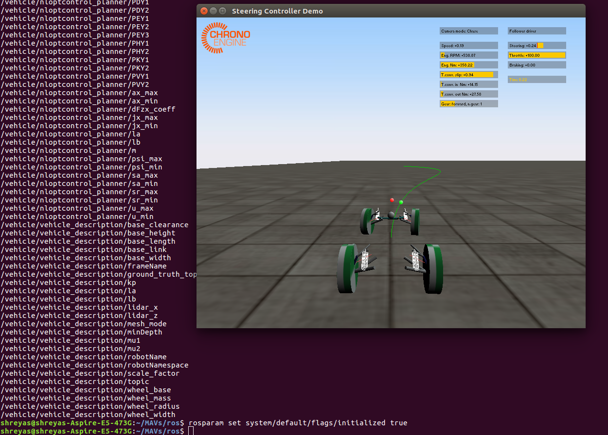
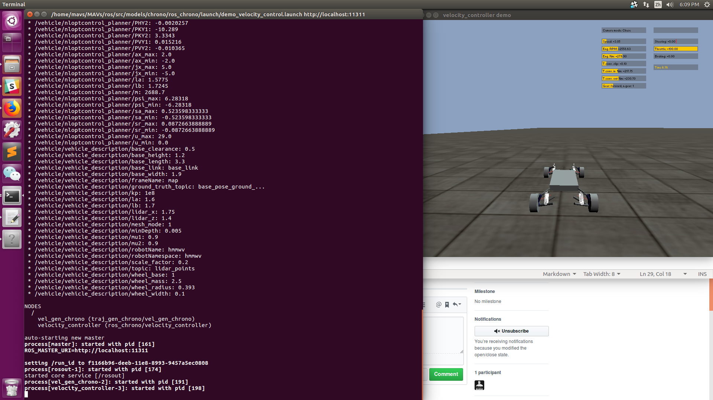

# ros_chrono
A HMMWV vehicle model developed in Project `Chrono` is controlled using `ROS` parameters by 4 different modes, which are described below.

## Mode 1: dynamic path following

In this mode, the HMMWV vehicle receives and follows dynamic paths with reference speed. The speed control and steering control are achieved internally using PID controllers.

To run the HMMWV vehicle using this mode, use the ROS node `path_following`.

```
$ rosrun ros_chrono path_following
```

### Input
The input includes the global coordinates of path points and the reference speed obtained from external planners. In the demo of path following, `planner_namespace` is `default`.

Name | Description
--- | ---
`planner_namespace/control/vx`| reference vehicle speed (m/s)
`planner_namespace/control/x`| global x coordinate vector of trajectory points (m)
`planner_namespace/control/y`| global y coordinate vector of trajectory points (m)

### Output

If an actual vehicle is used or an external model of the vehicle is used, `/nloptcontrol_planner/flags/3DOF_plant` should be set to `false`. The output includes vehicle information stored in `/vehicleinfo`.

Name | Description
--- | ---
`/vehicleinfo/t_chrono`| simulation time (s)
`/vehicleinfo/x_pos`| vehicle x position (m)
`/vehicleinfo/y_pos`| vehicle y position (m)
`/vehicleinfo/x_v`| vehicle velocity in x (m/s)
`/vehicleinfo/x_a`| vehicle acceleration in x (m/s^2)
`/vehicleinfo/y_v`| vehicle velocity in y(m)
`/vehicleinfo/y_curr`| current yaw angle (rad)
`/vehicleinfo/y_rate`| current yaw rate (rad/s)
`/vehicleinfo/sa`| steering angle (rad)
`/vehicleinfo/thrt_in`| throttle control input [0, +1]
`/vehicleinfo/brk_in`| brake control input [0, +1]
`/vehicleinfo/str_in`| steering control input (rad)

To view states updating while `Chrono` is running, open a new terminal and enter the container by

```
$ docker exec -it <container_name> /bin/bash
```

`<container_name>` can be auto-filled by the `Tab` key. Then run

```
$ rostopic echo /vehicleinfo
```

This displays all states and inputs specified in the `veh_status.msg` file.

### Notes
Currently this node only supports straight paths, but will be updated soon to support interpolation and curved paths.

For more explanation of the usage, please check the demo at the end of this document.

## Mode 2: dynamic steering trajectory following
[insert description]

### Input

### Output

### Notes

## Mode 3: dynamic speed trajectory following
[insert description]

### Input

### Output

### Notes

## Mode 4: dynamic speed and steering trajectory following
[insert description]

### Input

### Output

### Notes


## All  Modes
The following settings, flags, topics, and parameters apply to all modes.

## Settings
Name | Description
--- | ---
`system/chrono/flags/gui` | Disable/Enable Chrono GUI

## Flags
Name | Description
--- | ---
`system/chrono/flags/initialized` | Chrono ROS node is initialized
`system/chrono/flags/running` | Chrono simulation is running

## Topics
Name | Description
--- | ---
`/vehicleinfo` | Vehicle states, inputs, and time

## Parameters
The following parameters with SI units and angles in radians can be modified:

Name | Description
--- | ---
`/case/X0/actual/ax` | Initial x acceleration
`/state/chrono/X0/theta` | Initial pitch
`/case/X0/actual/r` | Initial yaw rate
`/state/chrono/X0/phi` | Initial roll
`/case/X0/actual/sa` | Initial steering angle
`/case/X0/actual/ux` | Initial x speed
`/case/X0/actual/v` | Initial velocity
`/state/chrono/X0/v_des` | Desired velocity
`/case/X0/actual/x` | Initial x
`/case/X0/actual/yVal` | Initial y
`/case/X0/actual/psi` | Initial yaw
`/state/chrono/X0/z` | Initial z
`vehicle/common/Izz` | (Moment of Inertia about z axis)
`vehicle/common/la` | Distance from COM to front axle
`/vehicle/common/lb` | Distance from COM to rear axle
`/vehicle/common/m` | Vehicle mass
`/vehicle/common/wheel_radius` | Wheel radius
`/vehicle/chrono/vehicle_params/frict_coeff` | Friction Coefficient (Rigid Tire Model)
`/vehicle/chrono/vehicle_params/rest_coeff` | Restitution Coefficient (Rigid Tire Model)
`/vehicle/chrono/vehicle_params/centroidLoc` | Chassis centroid location
`/vehicle/chrono/vehicle_params/centroidOrientation` | Chassis centroid orientation
`/vehicle/chrono/vehicle_params/chassisMass` | Chassis mass
`/vehicle/chrono/vehicle_params/chassisInertia` | Chassis inertia
`/vehicle/chrono/vehicle_params/driverLoc` | Driver location
`/vehicle/chrono/vehicle_params/driverOrientation` | Driver orientation
`/vehicle/chrono/vehicle_params/motorBlockDirection` | Motor block direction
`/vehicle/chrono/vehicle_params/axleDirection` | Axle direction vector
`/vehicle/chrono/vehicle_params/driveshaftInertia` | Final driveshaft inertia
`/vehicle/chrono/vehicle_params/differentialBoxInertia` | Differential box inertia
`/vehicle/chrono/vehicle_params/conicalGearRatio` | Conical gear ratio for steering
`/vehicle/chrono/vehicle_params/differentialRatio` | Differential ratio
`/vehicle/chrono/vehicle_params/gearRatios` | Gear ratios (indexed starting from reverse gear ratio and ending at final forward gear ratio)
`/vehicle/chrono/vehicle_params/steeringLinkMass` | Steering link mass
`/vehicle/chrono/vehicle_params/steeringLinkInertia` | Steering link inertia
`/vehicle/chrono/vehicle_params/steeringLinkRadius` | Steering link radius
`/vehicle/chrono/vehicle_params/steeringLinkLength` | Steering link length
`/vehicle/chrono/vehicle_params/pinionRadius` | Pinion radius
`/vehicle/chrono/vehicle_params/pinionMaxAngle` | Pinion max steering angle
`/vehicle/chrono/vehicle_params/maxBrakeTorque` | Max brake torque


## demoA | mode #1: dynamic path following

This demo controls HMMWV vehicle by mode 1, dynamic path following. Two straight paths, together with reference vehicle speed, are alternatively sent to the HMMWV vehicle. 

To run this demo:
```
$ roslaunch ros_chrono path_following.launch
```

### Expected Output


### Notes

When runing for the first time, the project may need to be built first.

```
$ cd MAVs/ros
$ catkin_make
```

## MODE2: dynamic steering trajectory tracking
[INSERT DESCRIPTION]

To run:
```

```
### Expected Output

### Notes

## MODE3: dynamic speed trajectory tracking
[INSERT DESCRIPTION]

To run:
```

```
### Expected Output

### Notes
## MODE4: dynamic speed trajectory tracking
[INSERT DESCRIPTION]

To run:
```

```
### Expected Output

### Notes


## OLD (below this)
A vehicle model in `Chrono` that can be used through `ROS`.

The vehicle model currently runs with rigid tire models, a rear-wheel driveline, double wishbone suspension (reduced so that the control arm positions are distance constraints), and rack and pinion steering.

## To run
```
$ cd $HOME/MAVs/ros
$ roslaunch ros_chrono demo.launch
$ rosparam set system/default/flags/initialized true
```

## Expected Output



## To run velocity test
Velocity test shows the ability of chorono to exchange information with ros.
```
$ roslaunch ros_chrono demo_velocity_control.launch
```
## Expected Output

=======

## To run steering tracking test
steering tracking test shows the ability of chorono to exchange information with ros.
```
$ cd $HOME/MAVs/ros
$ roslaunch ros_chrono steering.launch
```
## Expected Output

Under a constant speed, the vehicle will be controlled by the steering angle command to follow the steering angle trajectory.


## Miscellaneous notes (may be outdated!)
### Change Vehicle Initial Conditions
To change initial trajectory edit the parameters in the `hmmwv_chrono_params.yaml` config file.

```
$ sudo gedit ros/src/system/config/s1.yaml

```
To change target speed, edit:

```
$ sudo gedit ros/src/models/chrono/ros_chrono/config/hmmwv_params.yaml
```
### Change Values of Updated Path
For the path_follower demo, update the parameters of `/state/chrono/default/traj/yVal`, `/state/chrono/default/traj/x` in hmmwv_chrono_params.yaml. Change the system/planner parameter to chrono in chrono.yaml. In general, set system/planner to desired planner and update state/chrono/ <planner_name> /traj/x, vehicle/chrono/ <planner_name> /traj/yVal.


### Current Differences between 3DOF Vehicle model and HMMWV model:
Name |3DOF | Chrono | Description
--- | --- | --- | ---
`Izz` | 4,110.1 | 3,570.2 | Inertia about z axis
`la` | 1.5775 | 1.871831 | Distance from COM to front axle
`lb` | 1.7245 | 1.871831 | Distance from COM to rear axle
`Tire Model` | PACEJKA | RIGID | Tire model used by vehicle
